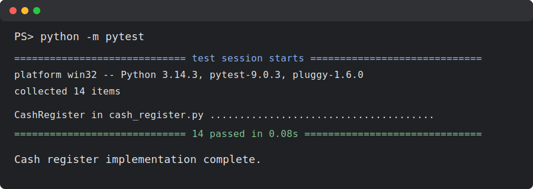

# Cash Register Lab

This project implements a small object-oriented cash register model in Python. The `CashRegister` class tracks items, totals, discounts, and previous transactions so the most recent transaction can be voided.



## Features

- Create a register with an optional percentage discount.
- Validate that discounts are integers from 0 through 100.
- Add single items or multiple quantities of the same item.
- Track all items in the order they were added.
- Record each transaction with its item, price, and quantity.
- Apply a register-wide discount to the current total.
- Void the last transaction and update the total and item list.

## Project Structure

- `lib/cash_register.py`: Cash register class implementation.
- `lib/testing/cash_register_test.py`: Pytest test suite for the lab.
- `Pipfile`: Python dependency definitions.

## Setup

Install the Python dependencies:

```bash
pipenv install
```

Run the tests:

```bash
python -m pytest
```

## Usage Example

```python
from lib.cash_register import CashRegister

register = CashRegister(20)
register.add_item("macbook air", 1000)
register.apply_discount()

print(register.total)
```

The discounted total is `800`.

## Test Status

The local pytest suite passes:

```text
14 passed in 0.08s
```
